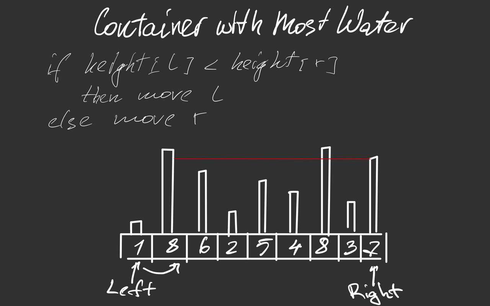

# Container With Most Water


## Brute Force Approach

### Intuition

It's possible to find the container with the most water simply by checking all
the pairs.

### Code (Python)

```python
class Solution:
    def maxArea(self, height: List[int]) -> int:
        most = float('-inf')
        for i in range(len(height)):
            for j in range(i + 1, len(height)):
                curr = (j - i) * min([height[i], height[j]])
                most = max(most, curr)
        return most
```

### Complexity

- Time: `O(n^2)`
- Space: `O(1)`


## Two Pointers Approach

### Intuition

It's possible to find the max amount by moving two pointers starting from the edges of the height array.
On each step, we should move a pointer with a lower height to try to find a higher height.



### Proof

We have two pointers: `l` - left pointer, `r` - right pointer.

Let's examine a case when at some point `l = i` and `r = j` and `height[i]` < `height[j]`.

According to the approach, we move the left pointer in this situation. 
That means we dismiss all possible pairs where `l = i`. So what we have to prove is that
all the possible pairs where `l = i` and `r` is anything between `i` and `j` have less capacity than
the container formed by `l = i` and `r = j`.

Let's recall that the capacity of a container is calculated as:
`length * height = (r - l) * min(height[l], height[r])`.

There are two terms: `length` and `height`.

Then for all `r` between `i` and `j` the length `(r - i)` is less than `(i - j)` which means that the first term 
in the formula gets smaller. And for `height` the minimal height 
between `height[i]` and `height[r]` can only get smaller than `height[i]` or stay the same. 

So all other pairs where `l = i` with capacity `length' * height'` have less capacity 
because `length' < length` and `height' < height`.

### Code (Python)

```python
class Solution:
    def maxArea(self, height: List[int]) -> int:
        l = 0
        r = len(height) - 1
        most = (r - l) * min([height[l], height[r]])

        while l < r:
            curr = (r - l) * min([height[l], height[r]]) 
            most = max(most, curr)

            if height[l] > height[r]:
                r -= 1
            else:
                l += 1
        
        return most
```

### Complexity

- Time: `O(n)`
- Space: `O(1)`
