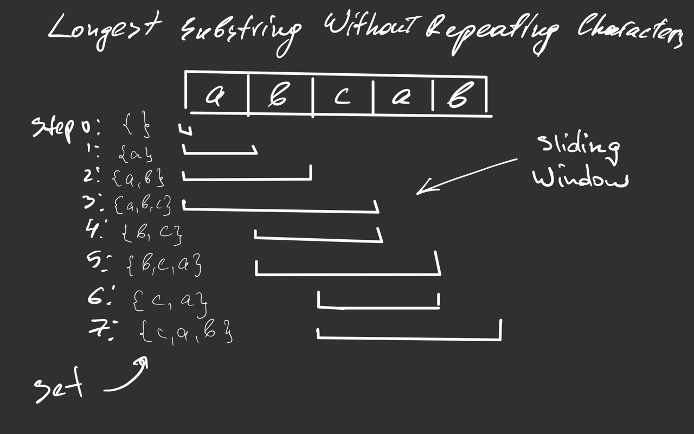

# Longest Substring Without Repeating Characters


## Brute Force Approach

### Intuition

The intutition for a brute force solution is to go over all characters from
the beginning and try to find the same character in the rest of the string.
If we find a repeating character then the length of the substring without 
repeating characters is the difference between the current and the 
repeating character indices. If there is no repeating character we can
consider that the rest of the string has no repeating characters.

### Complexity

- Time: `O(n^2)`
- Space: `O(1)`


## Sliding Window Approach

### Intuition

We'd like to traverse all substrings without repeating characters using
a sliding window. The idea is to keep in memory a set of all characters that
currenty appear in a sliding window. Thus, we are supposed to expand from 
the right if the next character isn't in the current set and
to shrink from the left if the next character is in the set. 

### Example

If we look at the example we can see how we move a sliding window.
Every time when the next character from the right is not in the set we expand
the window from the right. Otherwise, we shrink from the left. 



### Code (Python)

```python
class Solution:
    def lengthOfLongestSubstring(self, s: str) -> int:
        l = 0
        chars = set()
        longest = 0

        for r in range(len(s)):
            while s[r] in chars:
                chars.remove(s[l])
                l += 1
            chars.add(s[r])
            longest = max(longest, len(chars))

        return longest
```

### Complexity

- Time: `O(n)`
- Space: `O(n)`
