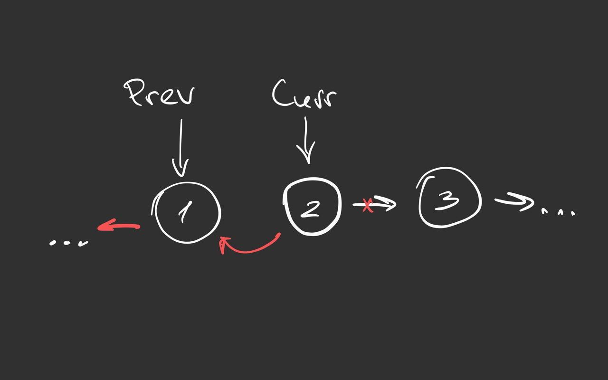
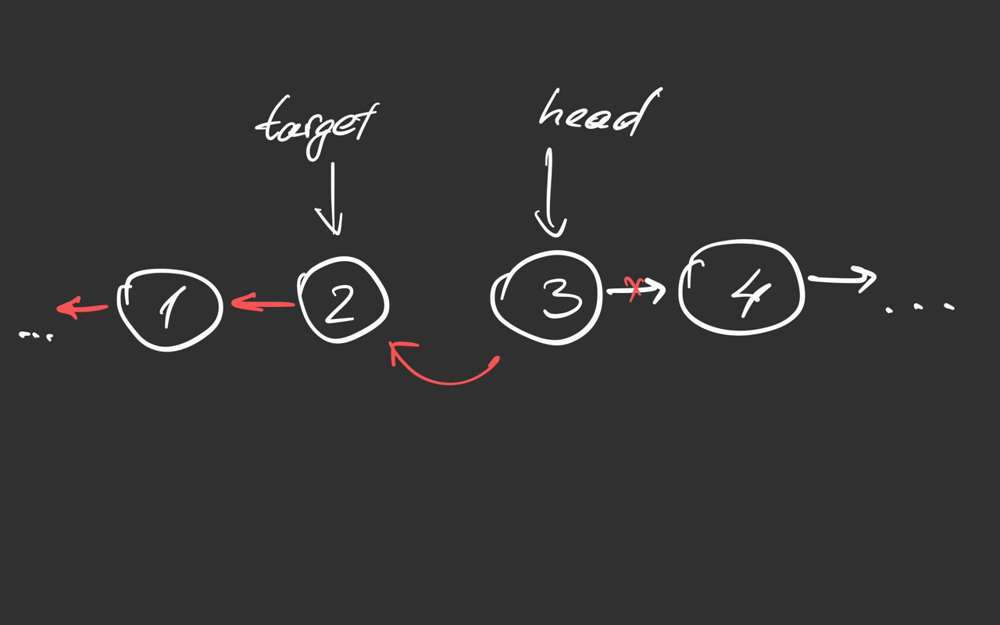

# Reverse Linked List

The follow-up points out that there are two solutions: iterative and recursive.

## Iterative Approach

### Intuition

The intuition behind the iterative approach is pretty naive. We just want to 
traverse a linked list and reverse each node by pointing to the previous node.
The only thing we should pay attention to is that we shouldn't lose a pointer 
to the original next node after reversing a node.



### Code (Python)

```
class Solution:
    def reverseList(self, head: Optional[ListNode]) -> Optional[ListNode]:
        if not head:
            return None
        prev = None
        curr = head
        while curr:
            next_ = curr.next
            curr.next = prev
            prev = curr
            curr = next_
        return prev
```

### Code (Java)

```
public class Solution {
    public ListNode reverseList(ListNode head) {
        if (head == null) {
            return null;
        }

        ListNode prev = null;
        ListNode curr = head;
        while (curr != null) {
            ListNode next = curr.next;
            curr.next = prev;
            prev = curr;
            curr = next;
        }

        return prev;
    }
}
```

### Complexity

- Time: `O(n)`
- Space: `O(1)`


## Recursive Approach

### Intuition

The recursive approach requires the problem to be solved using the
"Divide and Conquer" method. In other words, we should break down the problem
into sub-problems we can solve easily.

Let's try to describe the sub-problem for our case.
We have two parts of the original linked list: the already reversed part and 
the untouched part of the original list. Those two can be considered as two
completely separate linked lists which have to be merged in a "reversed" way.
We have to continue merging until the end of the original list.



After "reversing" node 3 from the example it becomes a new head of the target
or reversed list.

### Code (Python)

```
class Solution:
    def reverseList(self, head: Optional[ListNode]) -> Optional[ListNode]:
        return reversed_merge(None, head)

def reversed_merge(target, head):
    if not head:
        return target
    next_ = head.next
    head.next = target
    return reversed_merge(head, next_)
```

### Code (Java)

```
public class Solution {
    public ListNode reverseList(ListNode head) {
        return reversedMerge(null, head);
    }

    private ListNode reversedMerge(ListNode target, ListNode head) {
        if (head == null) {
            return target;
        }
        ListNode nextNode = head.next;
        head.next = target;
        return reversedMerge(head, nextNode);
    }
}
```

### Complexity

- Time: `O(n)`
- Space: `O(n)` (recursive stack)
