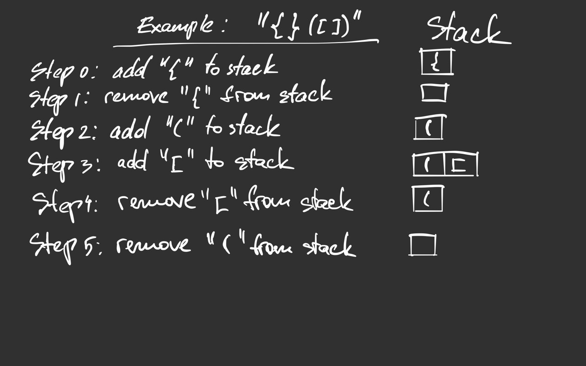
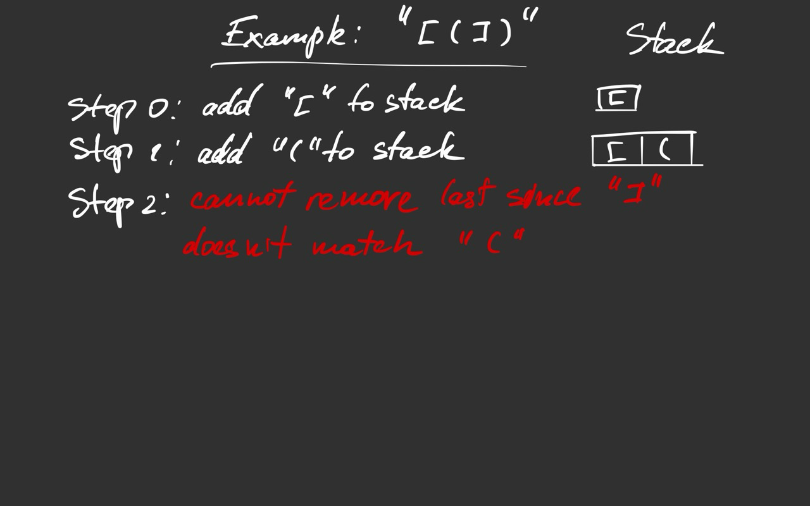

# Valid Parentheses


## Stack Approach

### Intuition

The main question is: "How can we validate parentheses?" or
"What rule do we have to stick to keep a sequence of parentheses valid?" 
The answer is that when we want to close a pair of parentheses we have to
make sure that it doesn't have any unclosed parentheses inside. If that rule
is violated the sequence is invalid.

Usually, when we deal with nested things the stack is a very useful data structure
since it helps track a level of "nestedness".

In our case, we would like to watch all open parentheses and make sure 
to close nested parentheses before closing the parent-level parentheses.
Of course, when we close a pair we have to take into account a type of
parentheses so the opening parenthesis fits the closing one.

After sequence traversal we have to check if the stack has any unclosed
pairs. If the stack is empty the sequence is valid.

### Example 1



### Example 2



### Code (Python)

```python
class Solution:
    def isValid(self, s: str) -> bool:
        CLOSING_TO_OPENING = {')': '(', '}': '{', ']': '['}
        stack = []
        for ch in s:
            if ch in CLOSING_TO_OPENING:
                if not len(stack) or stack.pop() != CLOSING_TO_OPENING[ch]:
                    return False
            else:
                stack.append(ch)
        return not stack
```

### Complexity

- Time: `O(n)`
- Space: `O(n)`
